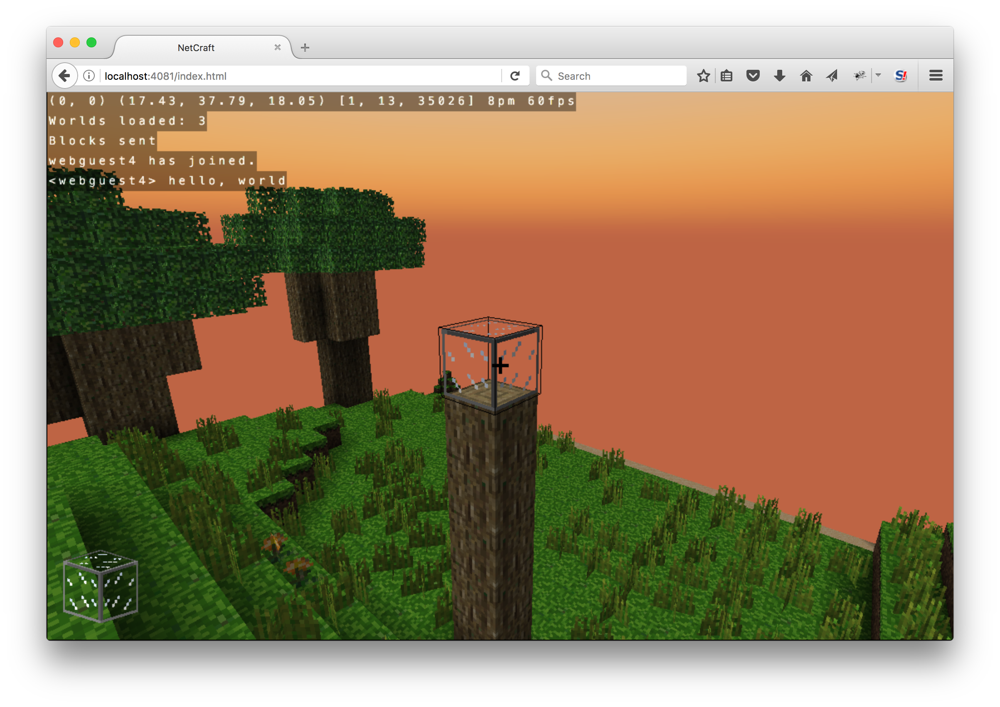

# WebSandboxMC

Bukkit plugin providing a web-based interface with an interactive WebGL 3D preview or glimpse of your server

Downloads: https://github.com/satoshinm/WebSandboxMC/releases/

## Features
Currently supports:

* Exposes a small piece of your server to web users, with configurable location and dimensions
* Web users can place/break blocks, and see server block changes in realtime
* Web users can send/receive chat, and other users can see their chat messages
* Web users can see players on your server and other web users move and rotate
* Sheep are spawned with custom names and track the web users movements

TODO: missing features

## Compilation
* Install [Maven 3](http://maven.apache.org/download.html)
* Check out this repository
* Check out and build [NetCraft](https://github.com/satoshinm/NetCraft) using emscripten, when it completes copy the build output into resources:
* `cp ../NetCraft/release-build-js/craft.* src/main/resources/`
* Build the WebSandboxMC plugin: `mvn package`

## Usage
* Copy target/WebSandboxMC.jar to the `plugins` folder of your [Glowstone](https://www.glowstone.net) server (note: may/not work with other Bukkit-compatible servers, TODO: test)
* Visit http://localhost:4081/index.html in a modern browser (requires WebGL, Pointer Lock, WebSockets)
* Play the game

## Configuration

After an initial run, `plugins/WebSandboxMC/config.yml` should be populated with configuration defaults.
The settings are as follows:

### http
Configures the HTTP and WebSocket server:

* `port` (4081): TCP port for the HTTP server to listen on
* `external_address` (localhost): externally-facing address of your server, for the web clients to connect to
* `external_port` (4081): externally-facing port for the web clients to connect to, normally the same as `port` but can be changed if you are using port forwarding/proxying

### mc
Configures what part of your world to expose:

* `x_center` (-85): specifies the center of the world from the web client's perspective, X coordinate
* `y_center` (78): " ", Y coordinate
* `z_center` (93): " ", Z coordinate
* `radius` (16): range out of the center to expose in each direction (cube), setting too high will slow down web client loading
* `entity_custom_names` (true): add web player names to the spawned entity's nametag if true
* `entity_disable_gravity` (true): disable gravity for the spawned entities if true

### nc
Configures the NetCraft web client:

* `y_offset` (20): height to shift the web client blocks upwards, to distinguish from the pre-generated landscape

## Compatibility

WebSandboxMC uses the [Bukkit API from Spigot](https://hub.spigotmc.org/javadocs/bukkit/) with the aim of maximizing
server compatibility. Known compatible server software:

* [Glowstone](https://www.glowstone.net): for a fully open source end-to-end gameplay experience
* [SpigotMC](https://www.spigotmc.org)

## License

MIT
